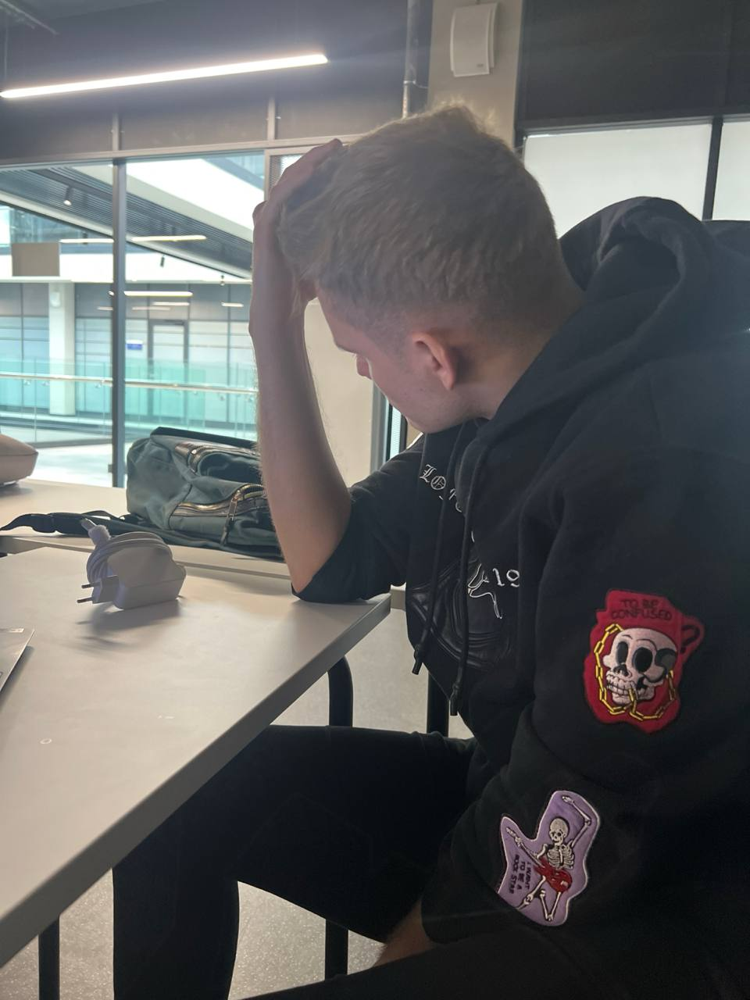

# RogueLike

### Общие сведения о системе

Название: Roguelike Game

Платформа: Windows, Linux, macOS

Язык: Python

Описание жанра: Roguelike — жанр RPG с процедурной генерацией уровней, перманентной смертью и пошаговой механикой.

### Architectural Drivers

Функциональные:

- Генерация подземелья.

- Генерация предметов.

- Использование инвентаря.

- Взаимодействие с врагами и предметами.
    
- UI.

Качественные атрибуты:

- Производительность.
- Масштабируемость.
- Удобство поддержки.

### Роли и случаи использования

Игрок: проходит уровни, собирает предметы, сражается с мобами
Мобы: атакуют преимущественно игрока, могут бить друг-друга

### Описание типичного пользователя

Игрок знаком с RPG играми
Цель: Выйти из подземелья.

### Композиция (диаграмма компонентов с описанием) и логическая структура (диаграмма классов с описанием)
[Ссылка](docs/README.md)

### Паттерны проектирования

* Dependency inversion
* Observer - подписка game_manager, level, room на события в своих детях
* State - изменение состояния уровней и комнат

### План приемки

| Этап | Критерий                                     | Проверка                          |
|------|----------------------------------------------|-----------------------------------|
| 1    | Генерация уровней         | Визуальная проверка |
| 2    | Игрок может перемещаться по комнате и между ними    | Ручная проверка                  |
| 3    | Враги наносят урон и перемещаются по комнатам                   | Визуальная проверка             |
| 4    | Предметы подбираются, выбрасываются и применяются           | Ручная проверка                       |
| 5    | Победа и проигрыш корректно срабатывают      | Ручная проверка                 |
| 6    | Стабильность работы программы      | Визуальная проверка                 |

